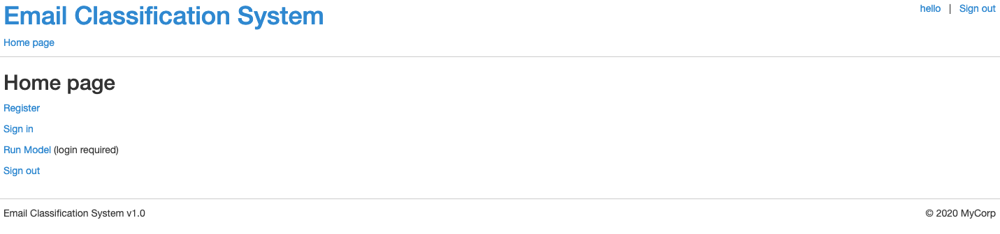
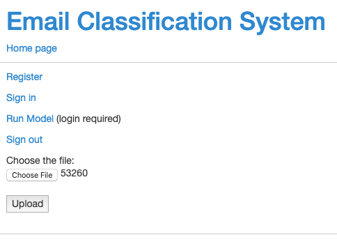
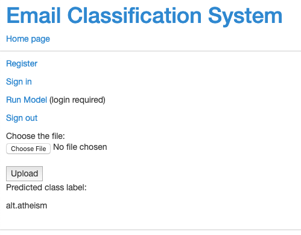

# Text classification
Use tf-idf as feature, build machine learning model to identify the topic of the text. Use python-flask to deploy the model.

## Build model
- Parse string data using regular expression match. Tokenize, remove stopwords and
punctuations, lemmatize words.
- Select features(words) and form tf-idf vector to represent a document, build training dataset
for sklearn classifiers
- Complete classification tasks using logistic regression, randomforest, naïve bayes classifier.
Use cross validation to find the best hyperparameter setting.
- Generate f1 score and confusion matrix for each class prediction

See ```../model/demo.ipynb``` for more details

## Deploy model
Use python-flask to deploy a web-based Email classfication app. Develop functionalities of sign-up, log-in,  profile modification, text classification etc. See ```../dockerimage/``` for details.

### Use Docker build

#### Install Docker
See more details in [Docker document](https://docs.docker.com/install/)

#### Build and serve Docker image

Clone the repository and enter into the folder that contains DockerFile

```$git clone https://github.com/balancehy/nlp.git```

```$cd ../nlp/TextClassification/dockerimage```

Start Docker. Build Docker image by running

```$docker build . -t "ImageName"```

If taking a close look, the source files are copied to the image path ```ImageName:Version/code``` and the python environment is set up using ```requirement.txt```. ```ImageName```and```Version``` are the Docker image name and version in your system.

Run

```$docker run -p 5000:5000 ImageName:Version python3 EmailClassification.py```

to start serving.

### Without Docker build

```$cd ../dockerimage/```

Install python packages according to the requirements

```$pip3 install -r requirements.txt```

Run below to start serving

```$python3 EmailClassification.py```

### Test locally

Open a browser, type url ```http://localhost:5000/``` to enter into home page if using Linux system. If using maxOS, replace ```localhost``` with the ip address of the virtual machine that runs Docker. To get this ip, run ```docker-machine ip [machine name]```.

The Home page



Upload text file for classification



After hit upload buttion


